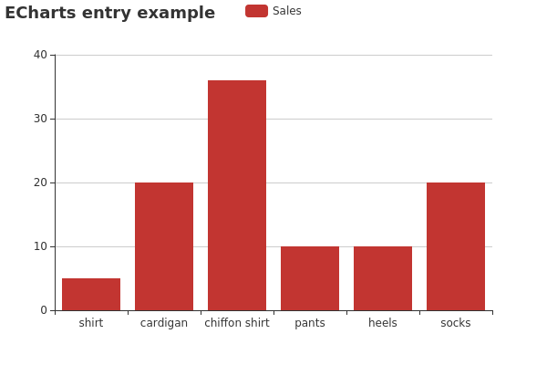

# Node.js server for offline export of ECharts graphs

This repository contains a Node.js application that starts a server which can
render ECharts graphs to PNG images.

## Requirements

This application needs two prerequisites:

* Node.js (preferably the latest LTS version)
* PhantomJS (installed via NPM)

### Installation of Node.js

The installation of Node.js is covered in a [separate document](./documentation/installation-node-js.md).

_(If you prefer a setup within a Docker container over a native installation,
then please take a look at [Setup with Docker](./documentation/docker.md).)_

## Initial setup: install Node.js dependency packages

The application requires a package for PhantomJS. To install that, type

    npm install

in the directory `export-server/`. You only need to do this once. The packages
are then cached in the `node_modules/` directory for future use.

However, PhantomJS does not offer a prebuilt package for some platforms, namely
ARM which is used by Raspberry Pi (among others). In such case you can install
the PhantomJS package provided by your package manager via

    apt-get install phantomjs

on Raspbian, or via

    yum install phantomjs

on RedHat-based distributions.

## Start the application

You can simply start the application via

    npm start

which fires up the Node.js application. The server will then listen on
<http://localhost:3000/> for incoming connections.

## Usage

To generate a PNG file of an ECharts plot, just send an HTTP POST request to the
running Node.js server on <http://localhost:3000/> containing the data for the
plot as JSON in its body.

For example, POSTing the following JSON code to the server

    {
      "title": {
        "text": "ECharts entry example"
      },
      "tooltip": {},
      "legend": {
        "data": ["Sales"]
      },
      "xAxis": {
        "data": ["shirt","cardign","chiffon shirt","pants","heels","socks"]
      },
      "yAxis": {},
      "series": [{
        "name": "Sales",
        "type": "bar",
        "data": [5,20,36,10,10,20]
      }]
    }

will generate a JSON response like e.g.:

    {
      "success": true,
      "filename": "graph-1520685763528.png"
    }

The field _filename_ in the response indicates the location of the generated
image file on the server. In the example above you could then get the image from
<http://localhost:3000/graph-1520685763528.png>. Given the data above the image
would look like this:

## Troubleshooting

If you encounter problems while trying to generate a chart image, then please
take a look at [the FAQ](./documentation/troubleshooting-faq.md). Some common
errors and possible solutions are listed there.

## Copyright and Licensing

Copyright 2018  Dirk Stolle

This program is free software: you can redistribute it and/or modify
it under the terms of the GNU General Public License as published by
the Free Software Foundation, either version 3 of the License, or
(at your option) any later version.

This program is distributed in the hope that it will be useful,
but WITHOUT ANY WARRANTY; without even the implied warranty of
MERCHANTABILITY or FITNESS FOR A PARTICULAR PURPOSE.  See the
GNU General Public License for more details.

You should have received a copy of the GNU General Public License
along with this program.  If not, see <http://www.gnu.org/licenses/>.
